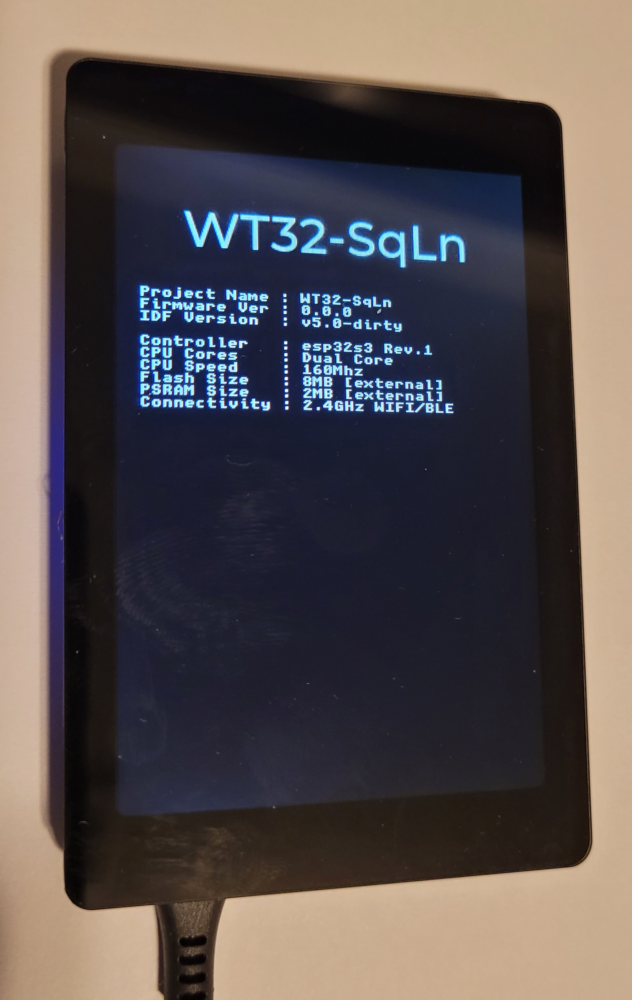

# WT32-SqLn
Getting started with Wireless Tag's WT32-SC01 Plus using SquareLine Studio, LVGL, and OTA updates.

## Overview
I recently bought a WT32-SC01 Plus but quickly grew frustrated when it came time to use it.
I found plenty of YouTube videos demonstrating it's amazing screen and performance,
all in an under-$30 device,
but somehow the "how did you compile then upload that application to the board?" question was never answered.
After plenty of digging and experiments and frustrating hours,
here's a detailed description of what I learned. Factual corrections and further contributions welcomed.

* [What you need to know right now](#what-you-need-to-know-right-now)
* [What you'll need](#what-youll-need)
* [Programming](#programming)
  * [Using the WT programmer](#using-the-wt-programmer)
  * [Using the USB-C port](#using-the-usb-c-port)
  * [Using your own USB-to-serial board](#using-your-own-usb-to-serial-board)
* [OTA updates](#ota-updates)
* [Squareline Studio](#squareline-studio)
* [Building This Example](#building-this-example)
* [Screenshots](#screenshots)
* [GPIOs](#gpios)
* [Partitions](#partitions)
* [3D-printed cases](#3d-printed-cases)

## What you need to know right now

1. It uses a ESP32-S3 WROVER, not a ESP32 VROOM.
1. You can't power it using the USB-to-serial board only
1. You cannot have WiFi and BLE actively on at the same time. You must put one to sleep before enabling the other.


## What you'll need

1. A [WT32-SC01 Plus board with programmer](https://www.alibaba.com/product-detail/Upgrade-WT32-SC01-plus-16MB-hmi_1600609718238.html)
1. [8-pin MX1.25 PicoBlade dongles](https://www.aliexpress.us/item/3256804401152079.html) if you plan on using GPIOs

or

1. A [WT32-SC01 Plus board](https://www.aliexpress.us/item/3256803559528956.html) without programmer
1. [7-pin MX1.25 PicoBlade dongles](https://www.aliexpress.us/item/3256804401152079.html) (get some 8-pin ones too if you plan on using GPIOs)
1. A normally-open momentary push button

or

1. A [WT32-SC01 Plus board](https://www.aliexpress.us/item/3256803559528956.html) without programmer
1. [7-pin MX1.25 PicoBlade dongles](https://www.aliexpress.us/item/3256804401152079.html) (get some 8-pin ones too if you plan on using GPIOs)
1. A [3.3V USB-to-Serial communication board](https://www.aliexpress.us/item/3256803764808791.html)
1. [2.54mm/0.1" pin header with suitable female connector housings](https://www.amazon.com/gp/product/B077X8XV2J)

and:

1. [ESP-IDF v5.0](https://docs.espressif.com/projects/esp-idf/en/latest/esp32/get-started/index.html)
1. [SquareLine Studio](https://squareline.io)
1. USB-C 2A power supply

## Programming

Unlike other ESP32 development boards, you can't simply connect the WT32-SC01 Plus via its USB-C port
and let the Arduino IDE do its magic.
You have to either use the custom programmer provided by WirelessTag,
or use the USB-C port and explicitly put it in flashing mode.
As the programmer wasn't included with the board I purchased and the explicitly-put-the-board-in-flashing-mode wasn't documented anywhere,
it was a particularly frustrating step to figure out.

If you bought the version that includes the programmer, see the "[Using the WT programmer](#using-the-wt-programmer)" section.

If you have a momentary-closed button, see the "[Using the USB-C port](#using-the-usb-c-port)" section.

If you are particular masochistic (or ignorant of the above-two options like I was),
see the "[Using your own USB-to-serial board](#using-your-own-usb-to-serial-board) section


##### Debug Interface on WT32-SC01 Plus
| Pin | ESP32 Pin | Voltage Range | Remark | Boot Button | Serial |
| --- | --------- | ------------- | ------ | ----------- | ------ |
| 1 | +5V | 5V | USB-to-serial not sufficient as power source | open | open/5V |
| 2 | +3.3V | 3.3V | For reference, not for power input | open | open |
| 3 | TXD0 | 3.3V TTL | | open | Rx |
| 4 | RXD0 | 3.3V TTL | | open | Tx |
| 5 | EN | 0-3.3V | Resets the ESP32 when pulled to GND | open | open |
| 6 | GPIO 0 | 0-3.3V | Enters flashing mode when pulled to GND during reset | button | GND/open |
| 7 | GND | 0V | | button | GND |


### Using the WT programmer

If you were fortunate enough to order a WT32-SC01 Plus that came with its own custom programmer, TBD


### Using the USB-C port

You can program via the USB-C port if your force the device into flashing mode.
However, since there is no BOOT button, you have to manually short the GPIO0 and GND pins on the Debug Interface.

Using a 7-pin MX1.25 PicoBlade dongle and a momentary-closed push-button,
create a cable to connect the GPIO0 and GND pins to the normally-open terminals of the button.

Here's my DIY programming cable Boot Button.
I was told of this option after hours of scouring the web
and finally [using a USB-to-serial programmer](#using-your-own-usb-to-serial-board) using the same approach as all other ESP32 MCUs.
That this Boot Button doubles as a release for all my pent-up frustration is no accident.


The following steps assume you have an application succesfully compiled using `idf.py build` (see [Build This Example](#build-this-example) section).
To program, then run your application with the serial monitor, connect the WT32-SC01 Plus via its own
USB-C port directly to your computer.

1. If you are using a Windows or MacOS machine, make sure you have the necessary driver installed for your USB-to-serial board.
   It is probably going to be a [CP210x](https://www.silabs.com/developers/usb-to-uart-bridge-vcp-drivers) or [CH34X](https://www.wemos.cc/en/latest/ch340_driver.html) driver.

1. To enter flashing mode, press your Boot Button, then press the `RST` button on the back of the WT32-SC01 Plus.
   Release the RST button first, then the Boot Button.

1. Flash your application using the command `idf.py flash`. Wait until the flashing process completes with a `Hard resetting via RTS pin...` message.

1. To run your application, reset the WT32-SC01 Plus again. The serial monitor will be automatically connected.


### Using your own USB-to-serial board

Using a 7-pin MX1.25 PicoBlade dongle and a 2.54mm/0.1" pin header connector housing that matches your board,
create a cable to connect the TX, RX, and GND pins on the Debug Interface
to the RX, TX, and GND pins respectively on your USB-to-serial communication board,
and using a *separate* 1-pin connector housing, connect the GPIO0 pin on the Debug Interface
to a *second* exposed GND pin on your USB-to-serial communication board.
It is important that it be possible to disconnect the GPIO0 wire from the USB-to-serial board
without disconnecting the other wires.

Here's my DIY programming cable.
I did connect the 5V line so I could easily identify which side of the connector was "up": the red wire goes with the VCC pin.
Notice how the white "GPIO0" wire is connected to a separate exposed GND pin on the programmer.


The following steps assume you have an application succesfully compiled using `idf.py build` (see [Build This Example](#build-this-example) section).
To program, then run your application optionally with the serial monitor, power the WT32-SC01 Plus via its own
USB-C port as well as connecting your serial board to a USB port on your computer.

1. If you are using a Windows or MacOS machine, make sure you have the necessary driver installed for your USB-to-serial board.
   Refer to the documentation provided by your board vendor for details.
   It is probably going to be a [CP210x](https://www.silabs.com/developers/usb-to-uart-bridge-vcp-drivers) or [CH34X](https://www.wemos.cc/en/latest/ch340_driver.html) driver.

1. To enter flashing mode, connect the GPIO0 wire to the GND pin, then press the `RST` button on the back
   of the WT32-SC01 Plus.

1. Flash your application using the command `idf.py flash`. Wait until the flashing process completes with a `Hard resetting via RTS pin...` message.
   Skip to step 6 if you are not using the serial monitor to debug your application.

1. Leave the GPIO0 wire connected to the GND pin and reset the WT32-SC01 Plus again.

1. Start the serial monitor using the command `idf.py monitor`. Wait until the monitor is running indicated by the following message:

```
--- idf_monitor on /dev/cu.wchusbserial54340143141 115200 ---
--- Quit: Ctrl+] | Menu: Ctrl+T | Help: Ctrl+T followed by Ctrl+H ---
```

6. To run your application, disconnect the GPIO0 wire, then reset the WT32-SC01 Plus again.


## OTA Updates

This trivial example application includes over-the-air (OTA) update cability.
Once the example application is flashed using the serial communication board,
you can use OTA updates instead for subsequent updates but takes longer to flash (approx 2mins).
As long as you do not modify the code up to the point where the spash screen is replaced
with the main screen, OTA should remain functional.

1. Build the latest version of the application using the command `idf.py build`

1. Start the OTA server using the command `python webserver.py`

1. Reset your WT32-SC01 Plus

1. While the splash screen is displayed, tap the project name 5 times to trigger an OTA upgrade.

For the upgrade to complete succesfully, you must have correctly specified your WiFi credentials and OTA server certificate when building.


## Squareline Studio

To add support for the WT32-SC01 Plus, copy the content of the `SquareLine/boards` directory into your Squareline Studio installation using the command

```
$ cp -r SquareLine/boards/* <Path to Squareline Studio installation>/boards
```

e.g. on my Mac:

```
$ cp -r SquareLine/boards/* /Applications/Squareline_Studio.app/Contents/boards
```

Restart Squareline Studio if it is was already running.

You'll find the Squareline Studio project for this example in `SquareLine/SquareLine_Project.spj`.
When exporting your UI files, export them in the `main/ui` directory


## Building This Example

After cloning this respository:

1. Update the component submodules using the commands `git submodule init` and  `git submodule update --progress`.
   Be patient. This can take a while.

1. Generate a self-signed certificate for the OTA https server using the command
   `openssl req -x509 -newkey rsa:2048 -keyout server_certs/ca_key.pem -out server_certs/ca_cert.pem -days 365 -nodes`.
   When prompted for the `Common Name (CN)`, enter the IP address of the server that the WT32-SC01 Plus will connect to.

1. Set your target device using the command `idf.py set-target esp32s3`

1. Copy the file `secrets.h` into the 'main' directory, and edit it to specify your WiFi credentials and OTA server certificate.
   The certificate can be found in the file `server_certs/ca_cert.pem`.
   ToDo: replace with menuconfig and get the certificate compiled into the binary directly.

1. Build the demo application using the command `idf.py build`

## Screenshots

  


## GPIOs

Only 6 GPIOs are exposed via the [8-pin MX1.25 PicoBlade](https://www.aliexpress.us/item/3256804401152079.html) Extended I/O interface.

##### Extended I/O Interface on WT32-SC01 Plus
| Pin | ESP32 Pin | Voltage Range | Remark |
| --- | --------- | ------------- | ------ |
| 1 | +5V | 5V+/-5% | Input or output |
| 2 | GND | 0V | Ground |
| 3 | GPIO 10 | 0-3.3V | |
| 4 | GPIO 11 | 0-3.3V | |
| 5 | GPIO 12 | 0-3.3V | |
| 6 | GPIO 13 | 0-3.3V | |
| 7 | GPIO 14 | 0-3.3V | |
| 8 | GPIO 21 | 0-3.3V | |


## Partitions

This example uses a custom partition for maximum application size.
Even though the example application is only 1.4MB, the ESP32-S3 is configured with two 4032KB partitions,
the largest OTA partitions you can have.

```
# ESP-IDF Partition Table
# Name, Type, SubType, Offset, Size, Flags
nvs,data,nvs,0x9000,16K,
otadata,data,ota,0xd000,8K,
phy_init,data,phy,0xf000,4K,
ota_0,app,ota_0,0x10000,4032K,
ota_1,app,ota_1,0x400000,4032K,
```

Refer to [Partition Tables](https://docs.espressif.com/projects/esp-idf/en/latest/esp32/api-guides/partition-tables.html) for more details about trade-offs.
Note that you cannot modify partitions via OTA. A change in partitions requires serial flashing.


## ToDo

* Get my code configurable using menuconfig


## 3D-Printed Cases

In the 3Dprint directory, you'll find STL files for 3D-printable cases

* BatteryCase: Compact case that can fit the WT32-SC01 Plus, a [3.7V lithium-ion battery](https://www.aliexpress.us/item/3256803919111184.html), a [charger module](https://www.aliexpress.us/item/3256804193670438.html), and a [power switch](https://www.aliexpress.us/item/2251832642923360.html).
  The USB-C opening and tabs to hold the charger module still need some tweaking.

  


## References

* https://github.com/sukesh-ak/ESP32-TUX
* https://github.com/espressif/esp-idf/tree/master/examples/system/ota
